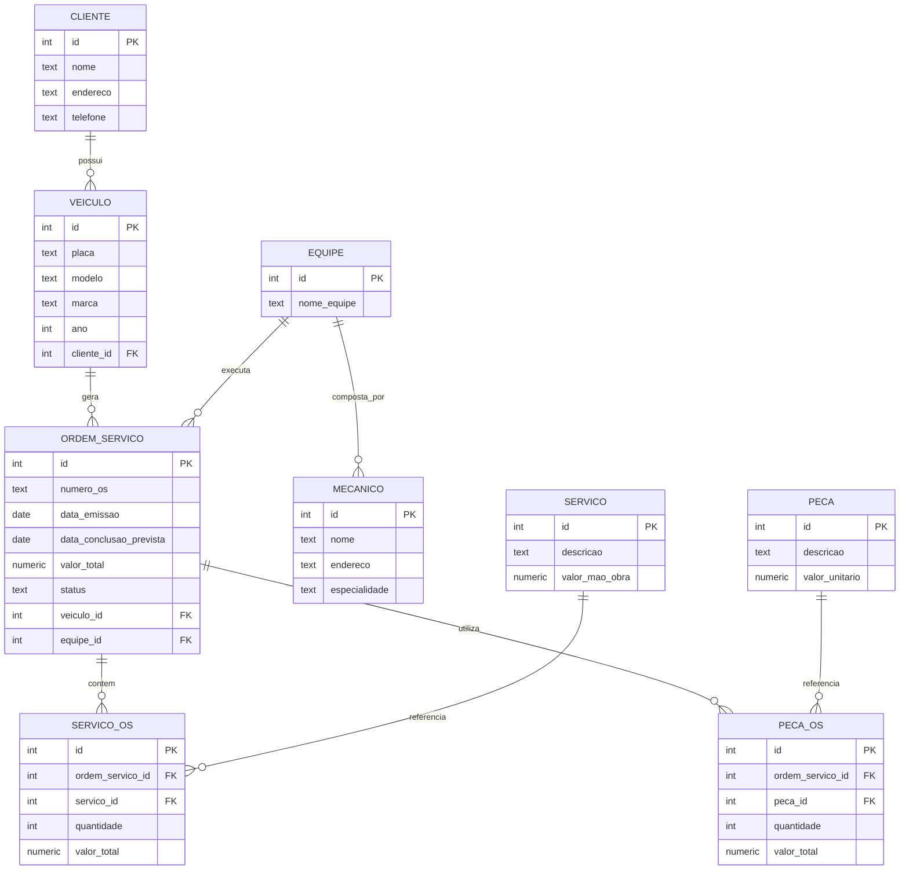

# Desafio de Projeto – Esquema Conceitual de Oficina Mecânica

## 1. Objetivo

Criar o **esquema conceitual** de um sistema de **controle e gerenciamento de execução de ordens de serviço (OS)** em uma **oficina mecânica**, a partir da narrativa proposta.  
O modelo visa representar de forma estruturada as entidades, relacionamentos e atributos necessários para o funcionamento do sistema, mantendo a integridade dos dados e a clareza das relações entre os elementos.

---

## 2. Descrição do Contexto

O sistema é responsável por controlar todas as etapas do processo de atendimento ao cliente em uma oficina mecânica.  
O fluxo principal inicia-se com o **cliente** que leva um **veículo** para manutenção ou revisão. Cada veículo é associado a uma **ordem de serviço (OS)**, a qual é executada por uma **equipe de mecânicos**.

A OS contém informações sobre **serviços** e **peças** aplicadas, além de **datas de emissão e conclusão**, **status** e **valor total**.  
O sistema também deve permitir calcular o valor final da OS com base na **tabela de referência de mão de obra** e nos valores das peças utilizadas.

---

## 3. Regras e Considerações

1. **Clientes** podem possuir **um ou mais veículos**.  
2. Cada **veículo** é identificado por sua **placa** e pertence a um único cliente.  
3. Cada **ordem de serviço (OS)** está vinculada a um único **veículo** e a uma única **equipe**.  
4. A **equipe** é composta por **mecânicos**, podendo participar de várias OS.  
5. Cada **OS** possui **serviços** e **peças**, que compõem o valor total da ordem.  
6. A **tabela de referência de serviços** armazena a descrição e o valor padrão da mão de obra.  
7. Cada **mecânico** possui: código, nome, endereço e especialidade.  
8. Cada **ordem de serviço** possui número, data de emissão, data prevista de conclusão, valor total e status (em aberto, em execução, concluída, cancelada).  
9. O **cliente autoriza** previamente a execução da OS.

---

## 4. Entidades Identificadas

| Entidade | Descrição |
|-----------|------------|
| **Cliente** | Armazena informações pessoais dos clientes. |
| **Veículo** | Contém os dados do veículo trazido pelo cliente. |
| **Mecânico** | Representa o funcionário da oficina, com especialidade e identificação própria. |
| **Equipe** | Agrupa mecânicos responsáveis por uma ou mais ordens de serviço. |
| **Ordem de Serviço (OS)** | Documento que controla o processo de manutenção, serviços e peças associadas. |
| **Serviço** | Tabela de referência de serviços e seus valores de mão de obra. |
| **Peça** | Catálogo de peças utilizadas nas ordens de serviço. |
| **Serviço_OS** | Entidade associativa entre OS e Serviço, contendo quantidade e valor. |
| **Peça_OS** | Entidade associativa entre OS e Peça, contendo quantidade e valor unitário. |

---

## 5. Diagrama Conceitual (Mermaid)

## 6. Considerações Técnicas

O modelo está normalizado até a 3ª Forma Normal (3FN), garantindo ausência de redundância e dependências parciais.

As relações muitos-para-muitos (entre OS e serviços/peças) foram resolvidas por entidades associativas (SERVICO_OS e PECA_OS).

O valor total da OS pode ser calculado dinamicamente pela soma dos valores de serviços e peças.

O status da OS é controlado por domínio restrito, podendo assumir valores como: “Aberta”, “Em Execução”, “Concluída” e “Cancelada”.

Cada equipe pode conter múltiplos mecânicos, e um mecânico pode participar de mais de uma equipe, se a regra de negócio assim permitir (configurável conforme contexto operacional da oficina).

## 7. Estrutura do Repositório
.
├─ README.md           
└─ schema/
   
   └─ oficina_conceitual.mmd (diagrama Mermaid do modelo conceitual)
